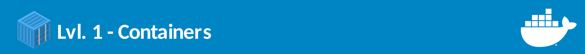
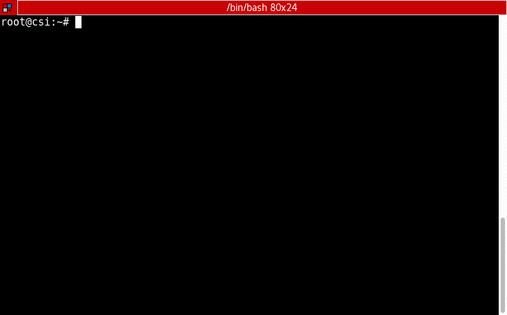

# Containers



Agora que estamos com ambiente configurado para executar Docker e o docker-compose, está na hora de colocar a mão na massa!


**Esse módulo é divido em:**

1. [Intrdução](#introdução)
2. [Hello World](#hello-world)
3. [Criando Containers](#criando-containers)
4. [Alguns Comandos Úteis](#comandos-Úteis)
5. [Primeiro Build com Containers](#Primeiro-Build)

## Introdução

O docker é uma ferramenta para criar e gerenciar containers, que assim como o nome sugere, é um compartimento para armazenar e/ou transportar objetos, no nosso caso o compartimento é criado através de **virtualização** em que memoria e o processamento são separados para o uso do exclusivo do container.

É importante frisar que container **não é uma máquina virtual**, os containers utiliza-se do próprio kernel da máquina hospedeira, enquanto as máquinas virtuais também virtualizam o kernel. Com containers é possivel **isolar bibliotecas e binários** dentro do mesmo SO sem a necessidade de virtualizar um novo sistema.


## Hello World

Para verificar que seu ambiente está configurado de forma correta, basta executar o seguinte comando abaixo, se aparecer a mensagem `Hello from Docker!` tudo ocorreu bem:

```
docker run hello-world
```


Ao executar esse comando, nós chamamos o binário do docker, criamos um container a partir da opção ``run`` e dizemos que o container que será criado é da `imagem` ``hello-world:latest``. (vamos falar de imagens mais a frente).

## Criando Containers

Vamos agora criar um container que seja mais útil e a partir dele analisar os principais comandos de criação de um container. Vamos criar um container do **Node**. Para isso executem:

```
docker run -it node bash
```



Dessa vez criamos um cointaner passando o parametro ``-it`` além de adicionar um ``bash`` no final, o parametro it signifca que você ganhará um **terminal interativo** ao exectuar o container, caso você não coloque essa opção o container executará suas instruções e quando o **seu comando principal** terminar de executar ele irá morrer. O comando ``bash`` irá executar o comando do shell no container, então dessa forma conseguimos ter um **shell interativo dentro do container**.

Reparem que o hostname foi alterado, nesse momento estou dentro do container ``node:latest``, para verificar isso eu executei o comando ``node -v`` que me retornou a versão 10.11, enquanto que na minha máquina, como também pode ser notado, utilizo a versão 8.9 do node.

**O node que roda na minha máquina não tem relação nenhuma com o node do container**, com esse isolamento podemos trabalhar com diversos serviços que utilizam versões diferentes da mesma tecnologia sem que entrem em conflitos.

Dentro do container, ao listar os processos que estão rodando com o comando ``ps`` vamos observar a seguinte saida:

```
PID TTY          TIME CMD
  1 pts/0    00:00:00 bash
  8 pts/0    00:00:00 ps

```

Só existe 2 processos rodando: o ps que acabamos de executar e o bash que executamos na criação do container, nesse caso, o processo principal é o ``bash`` (podemos observar pelo pid), caso esse processo morra o container também irá morrer.

Para sair do container  **sem matar o processo principal** execute ``Ctrl-p + q``.

## Comandos Úteis

Ao executar o útlimo comando que citamos acima, você terá o shell do seu computador de volta. Como você manteve o processo principal do container ainda rodando, significa que o container também está rodando!

### Listando Containers
para verificar os containers que estão rodando na sua máquina execute o comando:

```
docker ps
```

A saida será algo como:

```
CONTAINER ID        IMAGE               COMMAND             CREATED             STATUS              PORTS               NAMES
668698b20989        node                "bash"              7 minutes ago       Up 7 minutes                            kind_northcutt
```

1. **CONTAINER ID** - Identificador único do container.
2. **IMAGE** - Imagem que deu origem ao container.
3. **COMMAND** - Comando principal do container.
4. **CREATED** - Data na qual o container foi criado;
5. **STATUS** - Estado do container, pode ser: Up, ou Exited
6. **PORTS** - Portas de rede que o container está utilizando/expondo.
7. **NAMES** - O nome do container, para ser mais amigável de identificar no lugar do ID, na criação do container é possivel personalizar o nome com o para metro --name, por exemplo ``docker run --name My-Node -it node bash``

### Adicionando ou retirando arquivos do container

Ainda utilizando o exemplo do container node que criamos **kind_northcutt** (node gerado automaticamente, provavelmente será outro nome no seu computador), vamos adicionar os arquivos que esta na pasta ``/lvl1.containers/app`` nesse repositório.

A pasta ``app`` tem uma aplicação hello world em node, para tranferir os arquivos para dentro do container faça:

```
docker cp app/ NOME_DO_CONTAINER:/opt/
```

Como já dito, o `NOME_DO_CONTAINER` mudará de máquina pra máquina, verifique executando o comando ``docker ps`` já visto.

### Entrando no container

Até agora apenas entramos no container na hora de sua criação, para que possamos voltar ao ambiente do container devemos executar o comando:

```
docker exec -it NOME_DO_CONTAINER bash
```

A opção **exec** é voltado pra executar comandos dentro do container, porém, utilizamos da mesma estratégia quando criamos o container: passamos o parametro de terminal interativo e chamamos o shell.

Uma vez de volta ao container, acesse a pasta ``/opt/app`` em que copiamos os arquivos de `app`, os arquivos devem ser listados de forma parecida como abaixo:

```
root@668698b20989:~# cd /opt/app
root@668698b20989:/opt/app# ls
index.html  index.js  style.css
root@668698b20989:/opt/app#
```

## Primeiro Build

Agora que estamos com os arquivos node dentro do nosso container, podemos executar o primeiro build dentro do container, para isso execute:

```
npm install
```

e para subir nosso servidor web:

```
npm start
```

Se tudo correu bem você terá a seguinte saida:

```
root@668698b20989:/opt/app# npm start

> node-hello-world@0.0.1 start /opt/app
> node server.js

App listening on port 3000
Press Ctrl+C to quit.
```

Agora pressione novamente ``Ctrl-p + q`` para sair do container **salvando o estado atual** e em seguida pare o container que criamos com o comando:

```
docker stop NOME_DO_CONTAINER
```

e em seguida o remova:

```
docker rm NOME_DO_CONTAINER
```

Nesse módulo aprendemos o que é um container, executamos comandos básicos do docker e fizemos o build e deploy de uma aplicação web simples, porém, tudo de forma manual. No próximo módulo vamos aprender como automatizar o processo de build e deploy da aplicação. Criaremos nossa própria imagem!

#### [Próximo -> Lvl 2 - Images](http://github.com/victorhundo/docker-ceres/tree/master/lvl.2.images)
