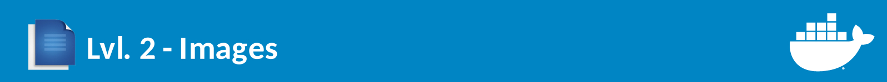
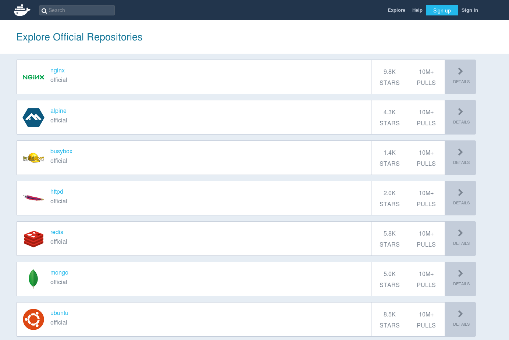

# Images



**Esse módulo é divido em:**

1. [Intrdução](#introdução)
2. [Docker Hub](#docker-hub)
3. [Dockerfile](#dockerfile)
4. [Criando a  Primeira Imagem](#primeira-imagem)


## Introdução

No módulo anterior nós copiamos os arquivos que estava na pasta ``/lvl.1.containers/app`` no repositório para que fosse possivel fazer o build e o deploy da nossa aplicação web exemplo, essa prática não é recomendada porque para uma aplicação grande contém vários arquivos além de outros programas/bibliotecas que precisam está instaladas no **ambiente da aplicação.** A melhor forma de customizar o container com as configurações necessárias para que sua aplicação funcione da melhor forma possivel é através de **imagens.**

## Docker Hub
Uma imagem docker é um container pré-configurado em que será utilizado como referencia **para criar containers**. No nosso exemplo, usamos a imagem **oficial** do Node, assim como containers, podemos visualizar as imagens que estão instaladas na nossa máquina digitando o comando:

```
docker image ls
```
A saida deve ser algo como:

```
REPOSITORY          TAG                 IMAGE ID            CREATED             SIZE
node                latest              8672b25e842c        10 days ago         674MB
hello-world         latest              4ab4c602aa5e        3 weeks ago         1.84kB
```

As imagens são baixadas do [Docker Hub](https://hub.docker.com/) que é o "github dos containers", lá você poderá encontrar a imagem base para os seus serviços:




Na data em que esse documento foi escrito esses foram as principais imagens oficiais que estão no Docker Hub. Em cada repoistório de imagem, existe as instruções de como criar o container.

## Dockerfile

Mesmo que no Docker Hub exista diversas soluções já desenvolvidas, você pode precisar de uma imagem específica da sua aplicação, uma imagem em que você e outras pessoas possam baixar e utilizar sua aplicação. Para isso é necessário criar um **Dockerfile**.

Dentro da pasta ``/lvl.2.images/app/`` existe um arquivo chamadao ``Dockerfile``, nele terá as instruções para criar a imagem da nossa aplicação web exemplo.

A primeira linha do Dockerfile diz qual será a imagem usada como base para criar a nossa própria imagem para isso usa-se o ``FROM``, no nosso caso será a imagem do Node na última versão disponível no Docker hub. Na segunda linha o ``LABEL`` adiciona meta dados à imagem, estamos colocando o nome de quem mantém essa imagem.

Pedimos que **acessem o arquivo ./lvl.2.images/app/Dockerfile** e altere o ``LABEL`` para o seu nome e email.

### FROM/LABEL
```
FROM node:latest
LABEL maintainer "Victor Hugo <victorhundo@gmail.com>"
```
### WORKDIR
Logo em seguinda em ``WORKDIR`` que nos vai dizer em qual pasta estará nosso diretório de trabalho, ao acessar o container essa será a pasta padrão. Utilizar workdir é importante para não se preocupar em caminhos absolutos na hora de rodar scripts.

```
WORKDIR /opt
```
### RUN
Agora executaremos comandos de instalação no container, podemos executar qualquer comando usando ``RUN``. O primeiro executa a instalação do nmap e em seguida remove o cache gerado pelo apt, porque **o container deve ser efêmero e o mais leve possível**, o seguida instala o pacote ``nodemon`` do npm.

```
RUN apt-get update && apt-get install -y \
    nmap \
&& rm -rf /var/lib/apt/lists/*

RUN npm install -g nodemon
```
### EXPOSE

``EXPOSE`` está relacionada a rede do container, ele informará que a **porta 3000 do container estará exposta** , essa informação é importante para a próxima parte dessa oficina quando falaremos da rede no Docker.

```
EXPOSE 3000
```

### COPY
Em seguida copiamos os arquivos da nossa aplicação web exemplo que estão no mesmo diretório do Dockerfile e colocando na pasta ``/opt`` dentro do container (a pasta que é nosso diretório de trabalho). Para isso usamos ``COPY``.

```
COPY ./* /opt/
```

### CMD
Por fim ``CMD`` chamará o comando principal do container, no nosso caso escolhemos que fosse o shell script ``start.sh`` que está em ``/lvl.2.images/app/`` porque nos dá a liberdade de executar várias instruções, dentro de start.sh está os comandos ``npm install`` e ``npm start``. Se start.sh parar de executar o container também irá parar.

```
CMD [ "bash", "/opt/start.sh"]
```
### Aprenda na prática
Para aprender mais sobre Dockerfiles e aprender na prática, recomendamos o [repositório da Jessie Frazelle](https://github.com/jessfraz/dockerfiles), lá você encontrará inúmeros dockerfiles, inclusive que utilize interfaces gráficas ou que explorem redes como o container do Tor que ela fez.

## Primeira imagem

Agora que aprendemos os conceitos e os caminhos para criar um Dockerfile, chegou a hora de montar nossa primeira imagem! Para isso entrem na pasta ``app`` desse módulo e executem:

```
 docker build . -t my_node:1
```

Se tudo ocorreu bem, ao executamos ``docker images ls``, veremos que nossa imagem com a tag 1 foi criada.

```
REPOSITORY          TAG                 IMAGE ID            CREATED             SIZE
my_node             1                   828e3f079092        27 seconds ago      723MB
node                latest              8672b25e842c        11 days ago         674MB
hello-world         latest              4ab4c602aa5e        3 weeks ago         1.84kB
```
Agora que temos a imagem da nossa aplicação web podemos criar um container a partir dela, pra isso executamos:

```
docker run -d --name my_app my_node:1
```
Dessa vez executamos utilizando o parametro "detached" -d, esse parametro é o oposto quando utilizamos -it, ele criará o container em "background", para visualizar as informações de criação do container execute:

```
docker logs -f my_app
```

Nesse módulo aprendemos os conceitos por trás da imagem do docker e criamos uma para a nossa aplicação web exemplo utilizando **Dockerfile**, porém ainda não acessamos nossa aplicação, no próximo módulo estudaremos a parte de rede dos containers e como fazer para acessar nossa aplicação web!
