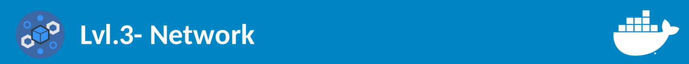

# Network




**Esse módulo é divido em:**

1. [Drivers](#drivers)
2. [Portas](#portas)
3. [Conectando dois containers](#conectando-dois-containers)

## Drivers
Uma das razões de que utilizar os serviços em containers ser tão poderoso é porque eles podem ser conectados entre si, os sistemas de rede do Docker são plugáveis usando **Drivers**, por padrão o Docker oferece 5 drivers:

1. Bridge - Esse é o driver que será usado caso você não especifique qual quer utilizar, esse driver criará uma rede específica para o container com comunicação com a rede da máquina real.
2. Host - Esse driver utilizará a mesma interface de rede da máquina real, logo, se o container utilizar a porta 80, por exemplo, será a porta 80 da máquina real.
3. Overlay - Utilizado para clusterização de containers.
4. Macvlan - Permite que o container receba um endereço MAC fazendo com que ele seja percebido como um despositivo físico.
5. none - Desabilita o uso de rede para o container.

A escolha dos drivers é feito na criação do container usando o parametro ``--net``, por exemplo:

```
docker run --net=host httpd:latest
```

**Nessa oficina iremos utilizar apenas o driver bridge.**

## Portas

Serviços em redes são acessados através de portas, páginas http (80), servidores de email (25), login remote (22), etc, precisam especificar além do enderço IP a porta de comunicação.

A nossa aplicação web exemplo roda na ``porta 3000``, para que possamos ter acesso na nossa máquina real, devemos criar o container com o seguinte comando:

```
docker run -d --name my_app -p 1915:3000 my_node:1
```

Repare que agora nós adicionamos mais um parametro na criação do container, o parametro ``-p`` significa que ao escutar na máquina real na porta ``1915`` quem responderá é o serviço que está rodando na porta ``3000`` dentro do container. Utilizamos 1915 mas poderiamos utilizar qualquer outra porta.

** Modifique o comando acima, e no lugar de 1915 adicione a data do seu aniversáro e em seguida acesse em um navegador web o endereço http://localhost:DATA_ANIVERSARIO**

Repare que podemos subir inúmeros containers do mesmo serviços em portas diferentes, assim, além de isolar memória, processamento, biblioteca/binários, o Docker também isola a rede para o funcionamento do container.

## Conectando dois containers

Até agora nós trabalhamos apenas com um container de aplicação web, mas geralmente uma apliação web também precisa de um banco de dados para funcionar, nós teríamos duas opções:

1. Instalar nosso banco de dados dentro do container da aplicação web
2. Criar um container apenas para o banco de dados

A segunda opção é a melhor prática, porque adicionando o container junto com a aplicação web tornará o container muito pesado e irá tirar o foco do container de isolamento do serviço, então a ideia é **1 serviço para 1 container**.

Utilizaremos a imagem oficial do Mysql para criar nosso container do BD, utilizando as instruções que tem no repositório no Docker Hub, fazemos:

```
docker run -d --name bd -e MYSQL_ROOT_PASSWORD=senha mysql:latest
```

O comando acima apresenta um **novo parametro** o ``-e`` criará uma variavel de ambiente dentro do container, nesse caso ``MYSQL_ROOT_PASSWORD``, que receberá o valor **"senha"**, variaveis de ambientes são utéis para personalizar pequenos ajustes na criação do container.

Ao executar ``docker ps``, deverá mostrar nossos 2 containers:

```
CONTAINER ID        IMAGE               COMMAND                  CREATED             STATUS              PORTS                    NAMES
20ce701cb413        mysql:latest        "docker-entrypoint..."   5 seconds ago       Up 3 seconds        3306/tcp, 33060/tcp      bd
4f263e37bf9e        my_node:1           "bash /opt/start.sh"     29 minutes ago      Up 29 minutes       0.0.0.0:1915->3000/tcp   my_app
```

Para que possamos fazer com que nossa aplicação se conecte com o container do mysql, precisamos remover o container da nossa aplicação e recria-lo:

Removendo:
```
docker stop my_app
docker rm my_app
```

Recriando com conexão com o container do BD:
```
docker run -d --name my_app -p 1915:3000 --link bd:my_bd my_node:1
```

O parametro ``--link`` informa ``NOME_DO_CONTAINER:APELIDO``, "nome do container" é o nome do container que vamos fazer a conexão e o apelido é por qual nome dentro do container irá reconhece-lo. Para verificar se a conexão de certo, vamos acessar o container da aplicação:

```
docker exec -it my_app bash
```

E em seguida vamos executar o nmap, esse programa varre as portas diponiveis de um determinado host, no nosso caso será o container do banco de dados, assim:

```
nmap my_bd
```

A saida deve ser algo como:
```
Nmap scan report for my_bd (172.17.0.3)
Host is up (0.000027s latency).
Not shown: 999 closed ports
PORT     STATE SERVICE
3306/tcp open  mysql
MAC Address: 02:42:AC:11:00:03 (Unknown)

Nmap done: 1 IP address (1 host up) scanned in 1.63 seconds
```
Repare que a porta padrão do mysql ``3306`` está aberta, logo, se nossa aplicação for fazer alguma consulta ao banco de dados poderá ser feito utulizando o "my_bd".
