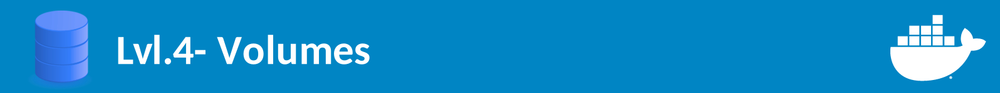

# Volumes




**Esse módulo é divido em:**

1. [Introdução](#intrdução)
2. [Tipos de volumes](#tipos-de-volumes)


## Introdução
Até agora nós vimos maneiras de utilizar containers para pegar isstemas já desenvolvido e inicia-lo em u mambiente controlado, também vimos que a ideia do container é que seja efêmero. Então como fazer com que os containers salvem os dados gerados? A repsosta para essa pergunta é **utilizando volumes!**

Ao criar um volume, os dados que estão nele serão montados em algum diretório especifico dentro do container, os volumes são salvos na máquina real, desta forma, garantimos a opersistencia dos dados já que eles ficam idepedente do container.

## Tipos de volumes
Existe dois tipos de volume: com bind e sem bind, volumes com bind são utilizados quando você quer especificar o caminho da sua máquina onde estão os dados do container enquanto volumes sem bind esse trabalho é feito pelo próprio Docker.

A criação do volume pode ser feito na criação do container utilizando o paramêtro ``-v``

```
# Exemplo de criação de volume com bind
-v /home/user/container_data:/opt/app
```

```
# Exemplo de criação de volume sem bind
-v /opt/app (volume sem bind)
```

Normamelnte volumes com bind são utilizados quando é preciso **fazer modificações** nos dados frequentemente, ao alterar os dados na pasta da sua máquina real em que está fazendo o bind, os dados dentro do container também serão alterados. **Arquivos de configuração ou códigos de desenvolvimento** são exemplos de bons usos dese tipo de volume.

Já os volume sem bind geralmente são utilizados quando queremos **apenas salvar as informações** e queremos apenas ler esses dados, **banco de ddados** é um exemplo que pode utilizar esse tipo de volme.


## Criando container para desenvolvimento

Assim como vimos que a melhorm maneira de criar um volume para desenvolvimento é utilizando bind, vamos criar o container da nossa aplicação novamente da seguinte forma:

```
docker run -d --name my_app -p 1915:3000 -v /docker-guide/lvl.4.volumes/app:/opt/ my_node:1
```

Acessem http://localhost:1915 para verificar que a aplicação está acessivel.

Em seguinda edite o arquivo `lvl.4.volumes/app/index.html` localize o nome ``Make Anything with Docker.`` e subsituta para ``Make My Web App with Docker.``

Atualize a página http://localhost:1915 e verifque as alterações, isso só foi possivél porque o arquivo dentro do container também foi modificado. Desta forma é possivel criar um ambiente docker para o desenvolvimento e não terá mais necessidade de configurar cada máquina para desenvolver a aplicação, basta ter Docker!
